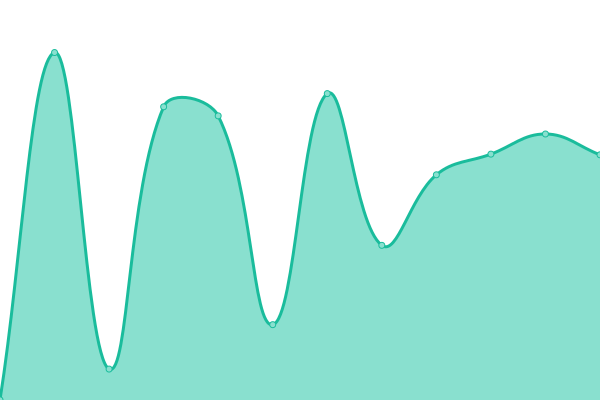

# [📈 Live Status](https://proger-su.github.io/upptime): <!--live status--> **🟩 All systems operational**

This repository contains the open-source uptime monitor and status page for [Sergey Pererva](http://proger.su), powered by [Upptime](https://github.com/upptime/upptime).

With [Upptime](https://upptime.js.org), you can get your own unlimited and free uptime monitor and status page, powered entirely by a GitHub repository. We use [Issues](https://github.com/proger-su/upptime/issues) as incident reports, [Actions](https://github.com/proger-su/upptime/actions) as uptime monitors, and [Pages](https://proger-su.github.io/upptime) for the status page.

<!--start: status pages-->
<!-- This summary is generated by Upptime (https://github.com/upptime/upptime) -->
<!-- Do not edit this manually, your changes will be overwritten -->
<!-- prettier-ignore -->
| URL | Status | History | Response Time | Uptime |
| --- | ------ | ------- | ------------- | ------ |
|  [Tarot Ana](https://www.tarot-ana.fr) | 🟩 Up | [tarot-ana.yml](https://github.com/proger-su/upptime/commits/HEAD/history/tarot-ana.yml) | 

 436ms
     
 | 

<a href="https://proger-su.github.io/upptime/history/tarot-ana">100.00%</a>
    

|  [H Daily](https://hdaily.astrofeed.ovh) | 🟩 Up | [h-daily.yml](https://github.com/proger-su/upptime/commits/HEAD/history/h-daily.yml) | 

 355ms
     
 | 

<a href="https://proger-su.github.io/upptime/history/h-daily">100.00%</a>
    

|  [Multi Hardware](https://www.multi-hardware.com/retrogami) | 🟩 Up | [multi-hardware.yml](https://github.com/proger-su/upptime/commits/HEAD/history/multi-hardware.yml) | 

 3492ms
     
 | 

<a href="https://proger-su.github.io/upptime/history/multi-hardware">99.94%</a>
    

<!--end: status pages-->

[**Visit our status website →**](https://proger-su.github.io/upptime)

## 📄 License

- Powered by: [Upptime](https://github.com/upptime/upptime)
- Code: [MIT](./LICENSE) © [Sergey Pererva](http://proger.su)
- Data in the `./history` directory: [Open Database License](https://opendatacommons.org/licenses/odbl/1-0/)
